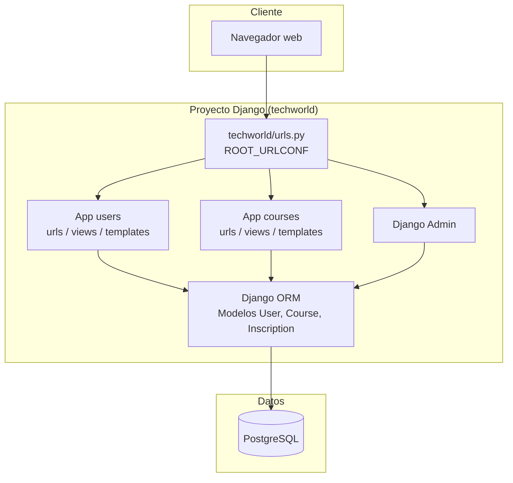
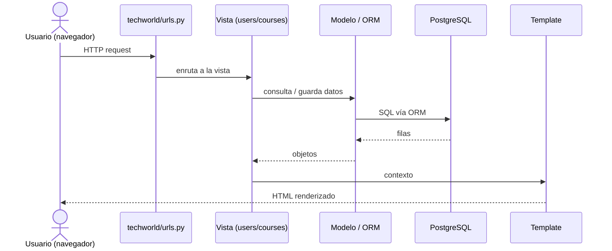

# TechWorld Learning Platform — Arquitectura

> Vista de alto nivel de cómo está construido el sistema y cómo se reparten las
> responsabilidades. Para el stack real (versiones, librerías) ver
> [`stack.md`](stack.md). Para el negocio ver
> [`../product/business-model.md`](../product/business-model.md).
>
> **Última actualización**: 2026-07-02

## Diagrama

## Componentes

| Componente              | Responsabilidad                                                                 | Tecnología           |
| ----------------------- | ------------------------------------------------------------------------------- | -------------------- |
| Proyecto `techworld`    | Configuración global (`settings.py`), enrutamiento raíz (`ROOT_URLCONF=techworld.urls`), WSGI/ASGI. | Django 5.1.3         |
| App `users`             | Registro y login de usuarios; modelo propio `User` (tabla `users`).             | Django (MTV)         |
| App `courses`           | Listado y creación de cursos e inscripción de usuarios (`Course`, `Inscription`). | Django (MTV)         |
| Capa de datos (ORM)     | Mapeo de modelos a tablas y acceso a la base de datos.                           | Django ORM + PostgreSQL |
| Django Admin            | Gestión administrativa de los modelos vía `/admin/`.                            | Django Admin         |

## Decisiones clave

| Decisión                                          | Razón                                                                                     |
| ------------------------------------------------- | ----------------------------------------------------------------------------------------- |
| Patrón MTV (Modelo-Template-Vista) con renderizado en servidor | Simplicidad y enfoque educativo; enseña el flujo completo de Django sin frontend separado. |
| Modelo `User` propio (no extiende `AbstractUser`) | Ejercicio didáctico de modelado; login manual comparando hashes de contraseña.            |
| Tabla intermedia `Inscription` con `progress`     | Modela la relación N:M entre usuarios y cursos añadiendo el progreso de cada inscripción. |
| PostgreSQL como base de datos                     | Acerca el proyecto a un entorno de producción real.                                       |

> El detalle y las alternativas de cada decisión relevante se registran como
> ADRs en [`../decisions/`](../decisions/README.md).

## Reglas no negociables

- Un usuario no puede inscribirse dos veces en el mismo curso (`unique_together = (user, course)` en `Inscription`).
- Las contraseñas nunca se almacenan en texto plano: se hashean con `make_password` al registrar y se verifican con `check_password` al iniciar sesión.
- Todo acceso a datos pasa por el Django ORM; no hay SQL crudo en las vistas.

## Flujos principales

Flujo general de una petición (patrón MTV):

Rutas principales:

- `/admin/` — Django Admin.
- `/users/register/` — `register` (POST crea usuario, hashea contraseña, redirige a login).
- `/users/login/` — `login_view` (POST verifica `username` + `check_password`, redirige a `home`).
- `/courses/` — `course_list` (lista todos los cursos).
- `/courses/create/` — `create_course` (POST crea curso).
- `/courses/<int:course_id>/enroll/` — `enroll_course` (POST inscribe al usuario, valida que no exista inscripción duplicada).

> **Deuda técnica conocida (autenticación):** el login es manual y no usa el sistema de sesiones de `django.contrib.auth`, por lo que no hay sesión persistente real. En `enroll_course`, `request.user` depende del middleware de auth de Django, lo que puede ser inconsistente porque el modelo `User` es propio y no el de Django. Mejora prevista: migrar a `AbstractUser` o al sistema de autenticación de Django.

## Referencias

- [`stack.md`](stack.md) — stack tecnológico y versiones.
- [`database.md`](database.md) — modelo de datos.
- [`auth.md`](auth.md) — autenticación y autorización.
- [`api.md`](api.md) — contrato de API.
- [`../conventions/`](../conventions/README.md) — convenciones de trabajo.
