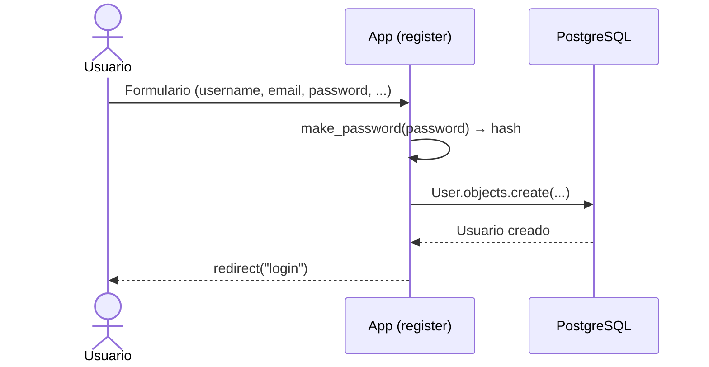
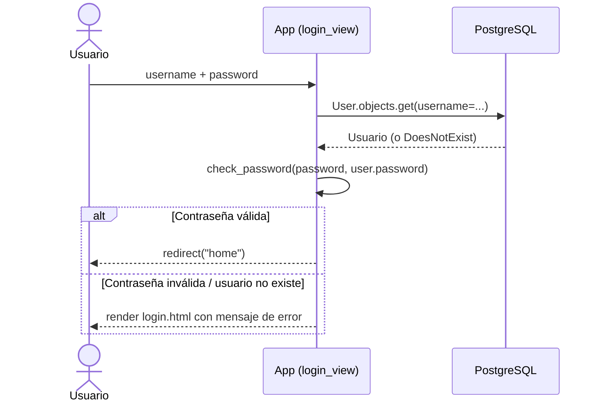

# Autenticación y Autorización

> Cómo se autentican y autorizan los usuarios en **TechWorld Learning Platform**.
> Para las reglas transversales ver [`../conventions/authentication.md`](../conventions/authentication.md).
>
> **Última actualización**: 2026-07-02

## Visión general

- **Método de autenticación**: implementación **manual** sobre el modelo propio `users.User`. No se usa `django.contrib.auth` para iniciar sesión: el login compara contraseñas a mano y **no crea una sesión persistente**.
- **Almacenamiento de credenciales**: en la tabla `users` de PostgreSQL. El campo `password` es un `CharField(128)` que guarda el hash generado por Django.
- **Hashing de contraseñas**: `django.contrib.auth.hashers.make_password` para hashear al registrar y `check_password` para verificar al iniciar sesión. Por defecto Django usa PBKDF2 (SHA256), por lo que ese es el algoritmo efectivo aunque no se configura explícitamente.

> **Aviso de honestidad técnica**: la versión actual (1.0.0) es un MVP educativo. El flujo de login valida credenciales pero **no autentica realmente una sesión de Django**. Ver [Deuda técnica y mejoras futuras](#deuda-técnica-y-mejoras-futuras).

## Modelo de identidad

| Concepto       | Descripción                                                                                                                                                              |
| -------------- | ------------------------------------------------------------------------------------------------------------------------------------------------------------------------ |
| Usuario        | Modelo propio `users.User` (tabla `users`). **No extiende `AbstractUser`**; es un `models.Model` normal. Campos clave: `username` (único), `email` (único), `password` (hash), `first_name`, `last_name`, `role`, `date_of_birth`, `city`, `created_at`. |
| Sesión / Token | **No aplica en la versión actual.** El login no genera sesión ni token; simplemente redirige tras validar la contraseña. No se emplea el framework de sesiones de Django para autenticar. |
| Roles          | Campo `role` con opciones `student` (Estudiante, valor por defecto) e `instructor` (Instructor). Hoy es puramente informativo: no se usa para restringir accesos. |

## Flujo de registro / login

### Registro (`POST /users/register/`)

- La vista `users.views.register` toma los campos del `request.POST`, hashea la contraseña con `make_password` y crea el registro con `User.objects.create(...)`.
- Tras crear el usuario redirige a la vista `login`.
- No hay verificación de email ni validación de fortaleza de contraseña.

### Login (`POST /users/login/`)

- La vista `users.views.login_view` busca el usuario por `username` y valida con `check_password`.
- Si es correcto, hace `redirect("home")`. **Nota**: en la versión actual no existe una ruta con nombre `home` definida en las `urls`, por lo que este redirect quedaría sin destino resuelto; es un punto pendiente de la implementación.
- Si falla, vuelve a renderizar `users/login.html` con `"Usuario no encontrado"` o `"Contraseña incorrecta"`.
- **No se establece ninguna sesión**: no se llama a `django.contrib.auth.login()` ni se guarda estado del usuario autenticado.

## Gestión de sesiones / tokens

- **Expiración**: No aplica en la versión actual (no hay sesión de autenticación propia).
- **Renovación**: No aplica en la versión actual.
- **Revocación**: No aplica en la versión actual.

> Django trae `SessionMiddleware` y `AuthenticationMiddleware` habilitados por defecto, pero el código de login **no** los utiliza para marcar al usuario como autenticado. Cualquier sesión de Django existente correspondería al usuario anónimo o al del panel `/admin/`.

## Autorización

- **Modelo**: No hay un modelo de autorización efectivo en la versión actual. El campo `role` existe en el modelo pero no se comprueba en ninguna vista.
- **Dónde se valida**: no se realizan comprobaciones de permisos en las vistas de `users/` ni `courses/`. Cualquier visitante puede acceder a listar cursos, crear cursos e intentar inscribirse.
- **Roles y permisos**:

| Rol          | Permisos                                                                                     |
| ------------ | -------------------------------------------------------------------------------------------- |
| `student`    | Rol por defecto. Semánticamente representa a quien se inscribe en cursos. Hoy sin aplicación real de permisos. |
| `instructor` | Semánticamente representa a quien crea cursos. Hoy `create_course` **no** exige este rol ni asigna instructor al curso. |

## Proveedores externos (OAuth / SSO)

- **No aplica en la versión actual.** No hay integración con proveedores externos de identidad.

## Recuperación de cuenta

- **No aplica en la versión actual.** No existe flujo de reset de contraseña, cambio de email ni verificación de cuenta.

## Consideraciones de seguridad

- Las contraseñas se almacenan **hasheadas** (nunca en texto plano) gracias a `make_password`.
- El panel `/admin/` sí usa el sistema de autenticación nativo de Django y sus superusuarios.
- La `SECRET_KEY` y las credenciales de base de datos se leen desde variables de entorno (`.env` vía `python-dotenv`).

Ver [SECURITY.md](../../SECURITY.md) para la política completa.

## Deuda técnica y mejoras futuras

El diseño de autenticación actual es funcional para un MVP educativo, pero tiene limitaciones importantes que se documentan de forma explícita:

1. **El login no crea sesión persistente.** `login_view` valida la contraseña y redirige, pero no llama a `django.contrib.auth.login()` ni guarda al usuario en la sesión. En la práctica, no queda ningún estado de "usuario autenticado".
2. **`request.user` es inconsistente con el modelo propio.** En `courses.views.enroll_course` se usa `user = request.user` para crear la `Inscription`. Como el login no autentica en el sistema de Django, `request.user` corresponde al modelo `django.contrib.auth.models.User` (o a `AnonymousUser`), que **no es** el modelo propio `users.User` al que apunta la FK de `Inscription`. Esto provoca una inconsistencia entre el usuario "logueado" y el usuario que se intenta inscribir.
3. **El modelo `users.User` no extiende `AbstractUser`** ni está declarado como `AUTH_USER_MODEL`, lo que impide reutilizar el ecosistema de auth de Django (decoradores `@login_required`, permisos, mixins, etc.).

**Mejora recomendada**: migrar la autenticación al sistema nativo de Django. Dos caminos posibles:

- Hacer que `users.User` extienda `AbstractUser` (o `AbstractBaseUser`) y configurarlo como `AUTH_USER_MODEL`, reemplazando el login manual por `authenticate()` + `login()` y protegiendo vistas con `@login_required`.
- O bien adoptar el modelo `User` nativo de Django y trasladar los campos extra (`role`, `date_of_birth`, `city`) a un perfil relacionado.

Cualquiera de las dos opciones resolvería la inconsistencia de `request.user`, habilitaría sesiones reales y permitiría implementar autorización por rol de forma robusta.
