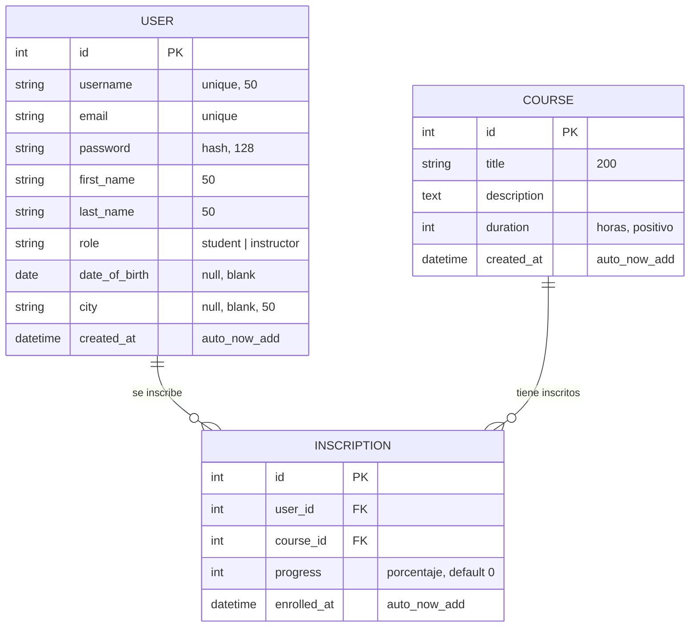

# Modelo de Datos

> Esquema, entidades y relaciones de **TechWorld Learning Platform**.
> Para las **reglas y estándares** de modelado (nomenclatura, tipos, índices)
> ver [`../conventions/database.md`](../conventions/database.md).
>
> **Última actualización**: 2026-07-02

## Diagrama Entidad-Relación

## Entidades principales

### User (app `users`, tabla `users`)

- **Propósito**: Representa a las personas de la plataforma (estudiantes e instructores). Es un modelo propio; **no** extiende `AbstractUser`.
- **Campos clave**:
  - `username` (CharField 50, `unique`) — identificador de acceso.
  - `email` (EmailField, `unique`).
  - `password` (CharField 128) — se almacena hasheado con `django.contrib.auth.hashers.make_password`.
  - `first_name`, `last_name` (CharField 50).
  - `role` (CharField 10, `choices=[("student","Estudiante"),("instructor","Instructor")]`, `default="student"`).
  - `date_of_birth` (DateField, `null`, `blank`).
  - `city` (CharField 50, `null`, `blank`).
  - `created_at` (DateTimeField, `auto_now_add`).
- **Relaciones**: 1:N con `Inscription` (un usuario puede tener muchas inscripciones).

### Course (app `courses`, verbose "Curso")

- **Propósito**: Representa un curso disponible en la plataforma.
- **Campos clave**:
  - `title` (CharField 200).
  - `description` (TextField).
  - `duration` (PositiveIntegerField) — duración en horas.
  - `created_at` (DateTimeField, `auto_now_add`); `ordering = ["-created_at"]`.
- **Relaciones**: 1:N con `Inscription` (un curso puede tener muchos inscritos). En la versión actual el modelo no asigna un instructor mediante FK.

### Inscription (app `courses`, verbose "Inscripción")

- **Propósito**: Tabla intermedia que modela la relación N:M entre `User` y `Course`, guardando además el progreso.
- **Campos clave**:
  - `user` (FK a `users.User`, `on_delete=CASCADE`).
  - `course` (FK a `Course`, `on_delete=CASCADE`).
  - `progress` (PositiveIntegerField, `default=0`) — porcentaje de avance.
  - `enrolled_at` (DateTimeField, `auto_now_add`).
- **Relaciones**: N:1 con `User` y N:1 con `Course`. Restricción `unique_together = (user, course)`.

## Relaciones y cardinalidad

| Relación                | Cardinalidad | Notas                                                        |
| ----------------------- | ------------ | ------------------------------------------------------------ |
| User → Inscription      | 1:N          | Borrado en cascada (`on_delete=CASCADE`).                    |
| Course → Inscription    | 1:N          | Borrado en cascada (`on_delete=CASCADE`).                    |
| User ↔ Course           | N:M          | Materializada a través de `Inscription` (con `progress`).    |

## Índices y restricciones

- `User.username` y `User.email`: restricción de unicidad (`unique`), evitan usuarios duplicados.
- `Inscription`: `unique_together = (user, course)`, impide que un usuario se inscriba dos veces en el mismo curso.
- Claves foráneas de `Inscription` (`user`, `course`) con `on_delete=CASCADE`: al eliminar un usuario o un curso se eliminan sus inscripciones.

## Migraciones y versionado del esquema

- Las migraciones se generan con `python manage.py makemigrations` y se aplican con `python manage.py migrate`.
- Al ser un MVP educativo, se mantiene el historial de migraciones de Django como fuente de versionado del esquema.

## Datos semilla (seeds)

- Los datos iniciales se cargan mediante fixtures JSON con `python manage.py loaddata`.
